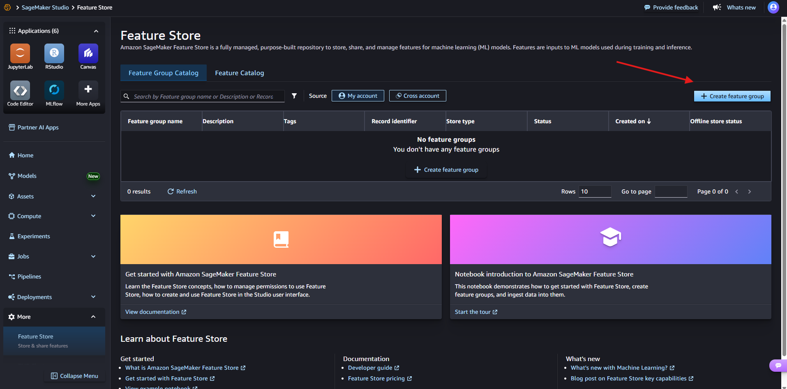
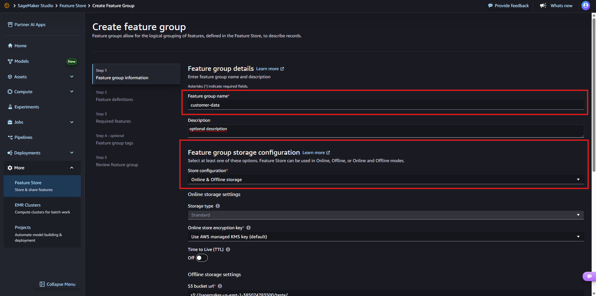
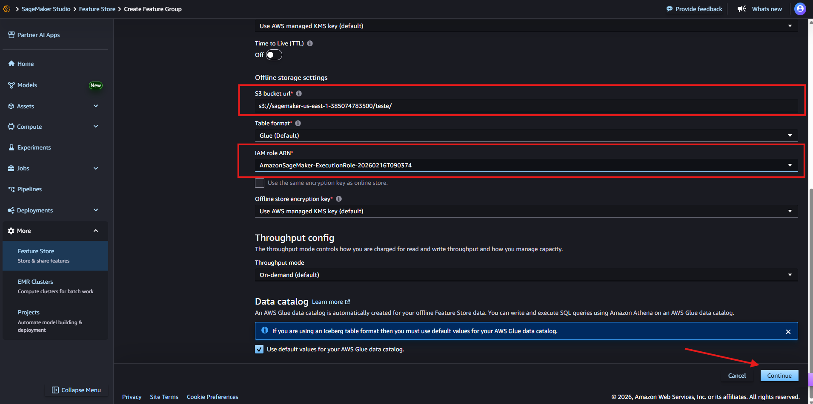
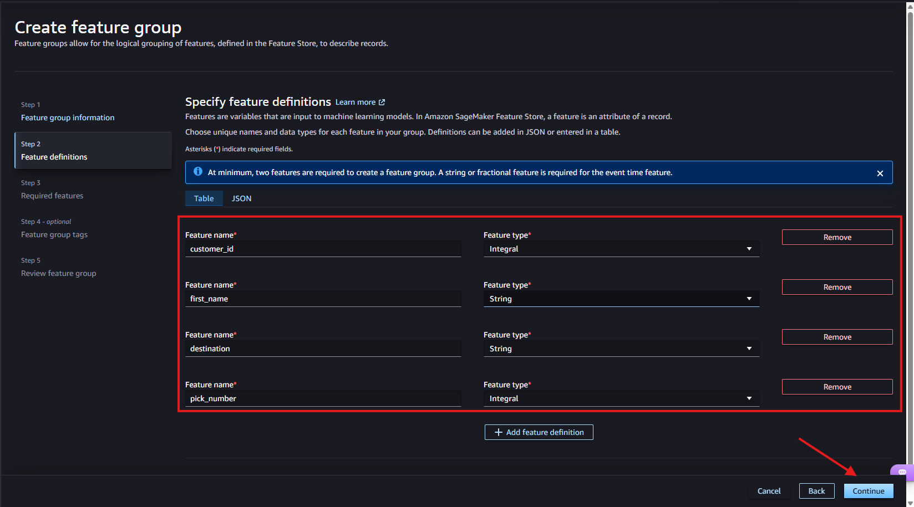
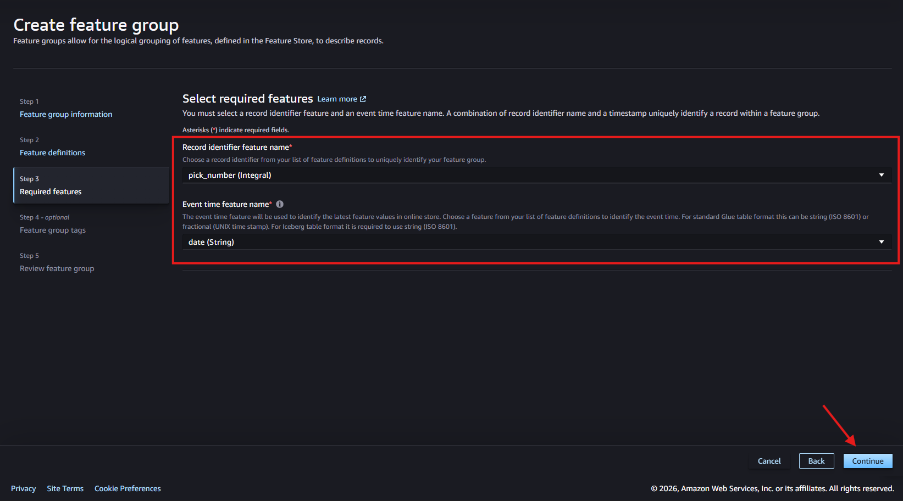
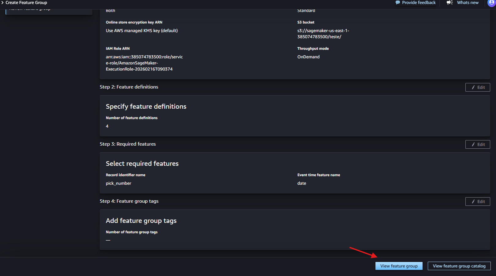
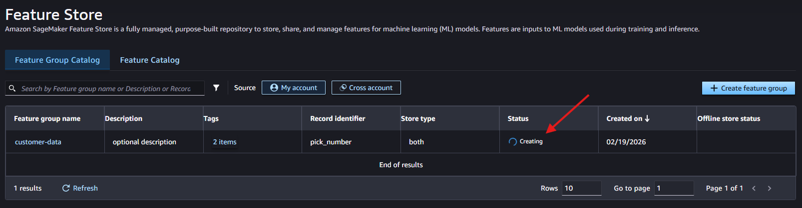

# Criando um Feature Group no Amazon SageMaker Feature Store (passo a passo)

Nesta seção, vamos criar um **Feature Group** no **Amazon SageMaker Feature Store** seguindo as telas do Studio.

Um **Feature Group** é um “conjunto lógico” de features (colunas) que descrevem um tipo de registro (ex.: cliente, pedido, transação). Ele serve para **armazenar, versionar e reutilizar** features de forma consistente entre **treinamento** e **inferência**.

## Quando usar Online store vs Offline store

- **Online store**: use quando você precisa consultar features em **tempo real** para **inferência com baixa latência** (ex.: API que precisa buscar features do cliente na hora de gerar uma previsão).
- **Offline store**: use para **treinamento e análises**, pois grava os dados no **S3** e integra com **Glue Data Catalog** e consultas via **Athena** (ótimo para montar datasets históricos e fazer analytics).
- **Online & Offline storage**: use quando você quer **treino + inferência** com a mesma fonte de features (padrão comum em projetos de ML).

---

## 01 - Acessar o Feature Store e iniciar a criação

No SageMaker Studio, acesse **Feature Store** e clique em **"Create feature group"**.

---

## 02 - Step 1: Feature group information

Nesta etapa, definimos as informações principais do grupo e **onde ele será armazenado** (online/offline).

### 02.1 - Definir nome e descrição
- **"Feature group name"**: nome do grupo (ex.: `customer-data`)
- **"Description"**: descrição opcional (para estudo, pode ser simples)

### 02.2 - Escolher Online / Offline
Ainda no **Step 1**, em **"Feature group storage configuration"**, selecione o tipo em **"Store configuration"**.

Na imagem foi selecionado **"Online & Offline storage"**.

- **Online storage**: inferência / baixa latência
- **Offline storage**: treino/analytics via S3 + Glue/Athena
- **Online & Offline storage**: quando queremos os dois cenários

> Os demais campos que já aparecem preenchidos e não estão marcados, deixaremos como **default**, pois o intuito aqui é **estudo/teste**.

---

## 03 - Offline storage settings (S3 + permissões)

Como selecionamos **Online & Offline storage**, o Studio exibe as configurações do **Offline store**.

Aqui você verá campos como:

- **"S3 bucket url"**: caminho do bucket/pasta onde o Offline store será gravado  
  Exemplo na imagem: `s3://.../teste/`
- **"IAM role ARN"**: role usada para permitir que o Feature Store grave no S3 e integre com o catálogo de dados

Na imagem, os campos já estão preenchidos, então manteremos os valores **default** do ambiente de estudo.

---

## 04 - Step 2: Feature definitions

Agora definimos as features (colunas) do nosso Feature Group.

Na imagem, foram cadastradas 4 features, com seus respectivos tipos:

- `customer_id` (Integral)
- `first_name` (String)
- `destination` (String)
- `pick_number` (Integral)

> Você pode adicionar mais features clicando em **"Add feature definition"**.  
> Como é um exemplo de estudo, manteremos exatamente como na imagem.

Depois, clique em **"Continue"**.

---

## 05 - Step 3: Required features

Nesta etapa, selecionamos:
- **"Record identifier feature name"**: a feature que identifica unicamente o registro (na imagem: `pick_number`)
- **"Event time feature name"**: a feature de tempo do evento (na imagem: `date`)

Na tela, os valores já estão selecionados, então **não precisamos ajustar nada**.
Clique em **"Continue"**.

---

## 06 - Step 4 (optional): Feature group tags

Esta etapa é opcional (tags para organização/custos/governança).  
Como o foco é estudo, **não vamos adicionar tags**.

Siga para o próximo passo (continuar).

---

## 07 - Step 5: Review feature group

Aqui é só revisar as informações e concluir a criação.
Após revisar, clique em **"Continue"** para criar o Feature Group.

---

## 08 - Confirmação de criação

Após criar, volte para o **Feature Group Catalog**.

Você verá o Feature Group na lista com status **"Creating"**.  
Aguarde até mudar para **"Created"** / **"InService"** (dependendo da atualização do console).

Quando estiver pronto, você pode clicar em **"View feature group"** para abrir os detalhes.

---
