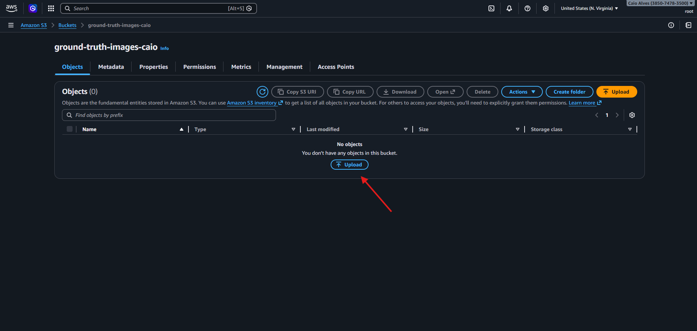

Primeiro, vamos preparar algumas imagens para **rotulagem de dados** como estudo do **SageMaker Ground Truth**, pensando em um **modelo de classificação de imagens** (image classification) que diferencie **tartarugas** e **gatos**.

## Conceito — Modelo de Classificação de Imagens
Um **modelo de classificação** é um tipo de modelo de Machine Learning que recebe uma entrada (neste caso, uma imagem) e retorna uma **classe** (rótulo) como saída.  
Aqui, o objetivo é: dado uma imagem, o modelo prever se ela pertence à classe **"tartaruga"** ou **"gato"**.

Para que isso funcione, precisamos de um dataset com imagens **rotuladas** (labeled), ou seja: cada imagem precisa estar associada ao rótulo correto. O **Ground Truth** entra exatamente nessa etapa: ajudar a criar e gerenciar esse processo de rotulagem.

As imagens do nosso estudo estão disponíveis em:  
`images/dataset/image.zip`

---

## Upload do dataset no S3

01 - Dentro do nosso bucket, selecionamos **"Upload"**.  

02 - Em seguida, clicamos em **"Add files"** para adicionar os arquivos manualmente.  

03 - Irá abrir a pasta do nosso computador. Selecione o arquivo **image.zip** (dataset).  

04 - Finalize clicando em **"Upload"**.  
Pronto! Agora nossos dados estão no S3 e já podemos seguir para a etapa de **rotulagem** no Ground Truth.  

