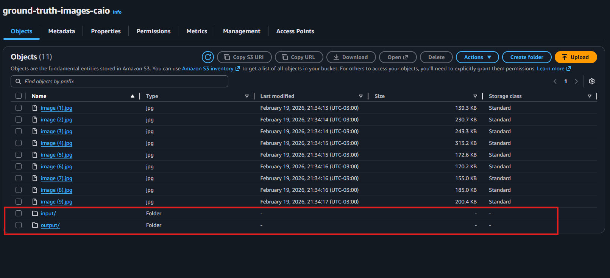
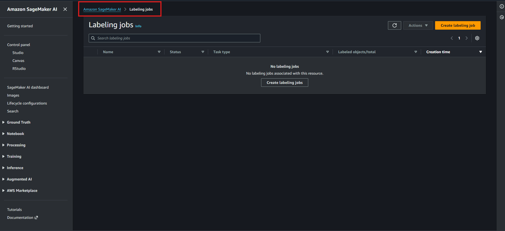
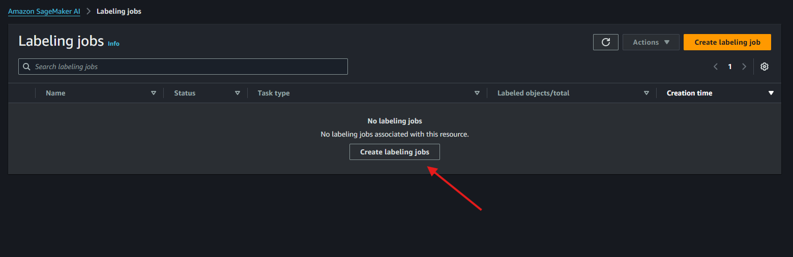
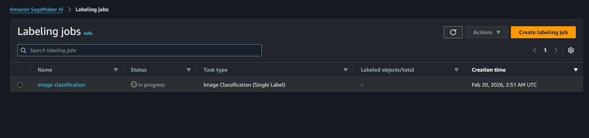
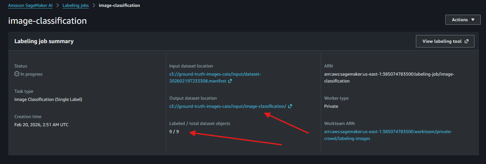

# SageMaker Ground Truth — Criando **Labeling Jobs** (rotulagem de imagens)

Aqui, criaremos nossos **labeling jobs** no **Amazon SageMaker Ground Truth** para rotular um dataset de imagens.

## O que é um **Labeling Job**?

Um **labeling job** é um “trabalho de rotulagem” que você cria no Ground Truth para transformar um dataset bruto (imagens, textos, vídeos, etc.) em um dataset **rotulado**.

No job você define:
- **qual dataset** será rotulado (input no S3)
- **qual tipo de tarefa** (ex.: classificação de imagem)
- **quem** vai rotular (workforce / team)
- **onde salvar** os resultados (output no S3)
- **instruções e labels** que os workers vão usar

No final, o Ground Truth gera os resultados no S3 (principalmente em **manifests**) para você usar no treinamento de modelos.

---

## 01 — Ajuste no S3: criar pastas **input** e **output**

Primeiro voltamos ao nosso bucket e criamos duas pastas:
- `input/`
- `output/`

Depois, movemos todas as nossas imagens para dentro da pasta **INPUT**.

Você pode fazer isso selecionando as imagens → **Actions** → **Move**.

---

## 02 — Acessar “Labeling jobs”

Agora vamos criar nosso labeling job.

Acesse no painel lateral:
**Ground truth → Labeling jobs**

---

## 03 — Criar o labeling job

Clique em **Create labeling job**.

---

## 04 — Configurar input/output e permissões (IAM Role)

Dentro da criação do nosso job:
- adicionamos um nome
- selecionamos em **"Input data setup"** a opção **"Automated data setup"**
- onde adicionaremos nosso local de **input** e **output**

Porém, antes precisamos acessar o **IAM**, pois precisamos de uma função (role) com permissão de acesso ao bucket/pastas do S3 que informaremos.

Acesse o serviço **IAM → Roles**.

Selecione a role que iremos usar no job e clique em:
**Add permissions → Attach policies**

Busque por policies de S3 e, como meio de demonstração, selecione **Full Access** e clique em **Add permissions**.

> Observação: em ambientes reais, o ideal é dar **somente as permissões necessárias** (least privilege), limitando o acesso ao bucket/prefixo específico.

Voltamos para a configuração do job, selecionamos nosso role e agora temos acesso ao local do S3 que configuramos:
- no campo **"S3 location for input datasets"** selecionamos a pasta `input/`
- no campo **"Data type"** adicionamos o tipo de rotulagem: **"Image"**

Após isso, clicamos em **"Complete data setup"**, onde serão criados no nosso bucket S3 os **manifests** do dataset.

### O que são **manifests** (e por que eles são importantes)?

Os **manifests** são arquivos (geralmente `.manifest`) no formato **JSON Lines** (um JSON por linha) que funcionam como a “lista oficial” do dataset dentro do Ground Truth.

Eles guardam, para cada item (imagem):
- **o caminho da imagem no S3** (input do job)
- e depois, quando a rotulagem acontece, também guardam:
  - o **rótulo** (label) escolhido
  - metadados do job (timestamps, worker, etc.)

Na prática:
- **Input manifest**: lista as imagens que precisam ser rotuladas
- **Output manifest**: lista as imagens + os **resultados da rotulagem**

✅ Esses manifests são o principal “resultado final” do Ground Truth e serão usados depois no **treinamento do modelo**.

---

## 05 — Selecionar o tipo de tarefa

Agora que temos tudo, podemos especificar o tipo de tarefa que queremos.

No nosso estudo:
**"Image Classification (Single Label)"**

Clique em **Next** para ir para a próxima etapa.

---

## 06 — Select workers and configure tool

Como dito antes, na configuração dos workers escolheremos a opção **Private**.

No campo **"Private teams"** selecione o team criado anteriormente em:
`Grounth Truth/setting_up_workforce/config_workforce.md`

### “Enable automated data labeling” — o que é isso?

Essa opção ativa o **Automated Data Labeling**, onde o Ground Truth:
1. usa uma parte do que foi rotulado por humanos para **treinar um modelo de ML**
2. esse modelo então consegue **pré-rotular** ou **rotular automaticamente** parte do dataset
3. e os humanos ficam apenas revisando amostras/itens com baixa confiança

✅ Quando vale a pena:
- datasets grandes
- rotulagem repetitiva
- você quer reduzir custo e tempo de rotulagem

No nosso caso, **não selecionaremos** essa opção pois temos poucos dados.

---

## 07 — Image classification (Single Label) labeling tool

Aqui você pode escrever instruções para os workers, por exemplo:

**Provide labeling instructions with examples below for workers. Workers will be viewing these instructions when they perform your task. Workers can choose up to 30 labels.**

Fique à vontade para adicionar:
- instruções curtas e objetivas
- exemplos
- labels (ex.: `cat`, `turtle`)

Clique em **Create** e vá para o próximo passo.

---

## 08 — Listagem do trabalho

Se tudo der certo, podemos ver a listagem:
- status do job
- total de objetos rotulados
- progresso geral

---

## 09 — Rotulando no portal do worker

Podemos voltar ao nosso portal de trabalhadores.

Depois de acessar com o email e senha temporária enviados, o worker verá os trabalhos disponíveis.

Selecione nosso job criado e podemos começar.

Selecione a opção de rotulagem da imagem e clique em **Submit**.

Faça isso com todos os dados.

---

## 10 — Conferir outputs (manifests) e usar no treinamento

Com nosso trabalho concluído, podemos voltar ao job e verificar:
- a **URL dos manifests** onde nossos outputs estão
- quantidade de dados rotulados
- quais dados foram enviados para `output/`

Depois, podemos utilizar esses dados rotulados para o **treinamento dos nossos modelos**.

