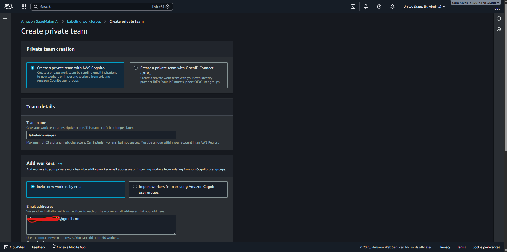
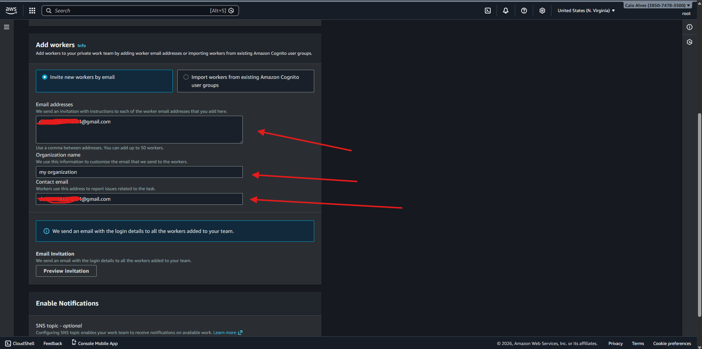

# SageMaker Ground Truth — Criando um **Labeling Workforce** (time de rotulagem)

Neste passo, vamos configurar um **Labeling Workforce** no **Amazon SageMaker Ground Truth**.  
O workforce é o “time” (pessoas) que vai **rotular os dados** (ex.: classificar imagens, desenhar bounding boxes, etc.) nos **labeling jobs**.

---

## O que são **Labeling Workforces**?

**Labeling Workforces** são as **forças de trabalho** usadas pelo Ground Truth para executar tarefas de rotulagem.  
Na prática, é onde você define:

- **Quem** vai rotular (usuários/rotuladores)
- **Como** eles vão acessar (portal de rotulagem)
- **Quais equipes (teams)** serão usadas nos trabalhos (jobs)

---

## 01 — Acessar “Labeling workforces” no Ground Truth

Na tela do SageMaker, acesse:

**SageMaker Ground Truth → Labeling workforces** (menu lateral)

Aqui é onde você cria e gerencia suas forças de trabalho (workforces).

---

## 02 — Escolher o tipo de workforce

Você verá 3 opções principais:

1) **Private (Privado)**  
2) **Amazon Mechanical Turk**  
3) **Vendor (Terceirizado)**

Neste estudo, vamos criar um **time privado** (Private workforce).

### Explicando os 3 tipos

#### 1) **Private workforce**
- Ideal quando **você mesmo** (ou seu time) vai rotular.
- Você convida pessoas por e-mail (workers) e elas acessam um **portal de rotulagem**.
- Bom para: **times internos**, estudos, dados sensíveis, controle total.

#### 2) **Amazon Mechanical Turk**
- Usa uma força de trabalho pública do Mechanical Turk.
- Bom para: alto volume de rotulagem com rapidez (quando dados não são sensíveis).
- Atenção: envolve custos e políticas específicas; nem sempre é ideal para dados privados.

#### 3) **Vendor (Terceirizado)**
- Empresas parceiras especializadas em rotulagem.
- Bom para: operações em escala com SLA e suporte.
- Mais comum em cenários corporativos com orçamento e demanda grande.

---

## 03 — Criar um **Private team** (time privado)

Na configuração do time, você vai preencher:

- **Team name**: nome do seu time (ex.: `labeling-images`)
- **Email addresses**: e-mail(s) que receberão convite para ser worker
- **Organization name**: nome da sua organização (aparece no convite)
- **Contact email**: e-mail de contato (suporte para dúvidas do worker)

> Dica: use um nome simples e descritivo para o team, porque ele será selecionado depois ao criar um Job.

Após preencher, clique em **Create private team** e vá para o próximo passo.

- **Team name**: identifica a equipe que você vai selecionar dentro dos **labeling jobs**.
- **Email addresses**: define quem será convidado como **worker**.
- **Organization name**: personaliza o convite/portal.
- **Contact email**: canal para o worker reportar problemas na rotulagem.

---

## 04 — Ver o time criado e entender o fluxo do convite

Depois de criado, você verá:

- A **listagem do seu team**
- A lista de **workers**
- O status do worker (ex.: convite enviado)

O worker vai receber um **e-mail de convite** no endereço cadastrado.  
Nesse e-mail, normalmente ele recebe:
- Um **username**
- Uma **senha temporária**
- Um link para o **Labeling portal sign-in URL**

Ao acessar o portal pela primeira vez, ele poderá ser obrigado a **trocar a senha** (fluxo padrão do Cognito).

Depois disso, você (ou seu worker) terá acesso aos **trabalhos de rotulagem (labeling jobs)**.

---

## O que são **Labeling Jobs**?

**Jobs** são as **tarefas de rotulagem** que você cria no Ground Truth para gerar dados rotulados.

Exemplos de jobs:
- Classificação de imagem (ex.: `cat` vs `turtle`)
- Bounding box (detectar objeto e desenhar caixa)
- Segmentação semântica
- NER (texto), etc.

Um job define:
- **Qual dataset** será rotulado (normalmente vindo do S3)
- **Qual tipo de rotulagem** (classificação, bbox, etc.)
- **Quais classes/rótulos** existirão
- **Qual workforce/team** vai executar
- **Onde salvar o resultado** (output no S3)

---

## checklist rápido

- ✅ Team aparece em **Private teams**
- ✅ Worker aparece em **Workers**
- ✅ Worker recebeu e-mail e consegue abrir o **Labeling portal sign-in URL**
- ✅ Worker consegue logar (mesmo que peça troca de senha)
- ✅ Você consegue selecionar esse **team** quando for criar um **Labeling job**
